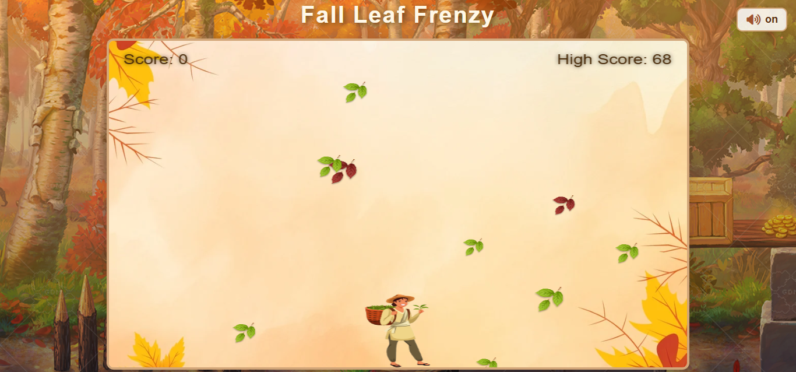

# Fall Leaf Frenzy

Fall Leaf Frenzy is a fun and cozy autumn-themed game where you control a basket to catch colorful falling leaves. The goal is to earn the highest score possible by catching green, yellow, and rainbow leaves while avoiding red and black ones. Each game becomes more exciting as the leaves fall faster, testing your reflexes and focus. With cheerful sounds, smooth gameplay, and a warm fall background, this project was made to bring a relaxing yet challenging experience inspired by the beauty of the fall season.

## Technologies Used
- HTML
- CSS
- JavaScript

## Screenshot
